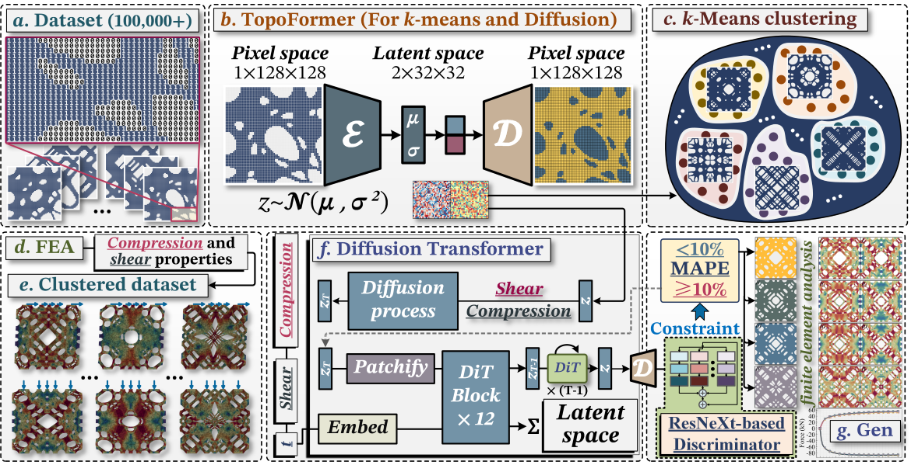
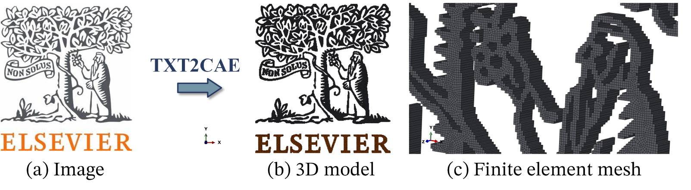
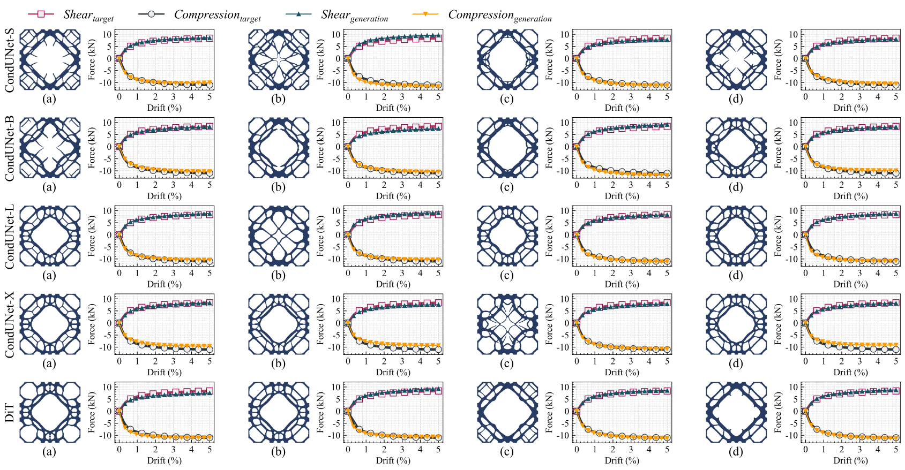
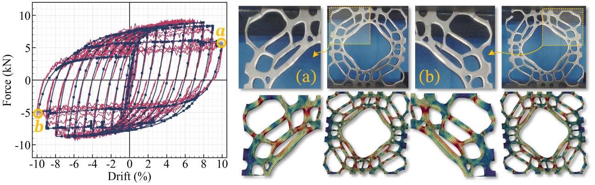
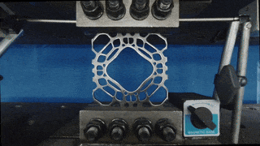

  
# Latent Diffusion–Driven Inverse Design of Damping Microstructures with Multiaxial Nonlinear Mechanical Targets

 

* ## ⚠️ **_Preface_**
The dataset used in this study is extremely large; even after a **_90% reduction_**, the numerical model still required **_1.13 TB_** of memory. Public datasets for microstructure inverse design are currently **_very scarce_**. We are therefore pleased to share such datasets, and part of the curated data has already been made available at [**_🔗MultiDampGen_**](https://github.com/AshenOneme/MultiDampGen) and [**_🔗SSIDM_**](https://github.com/AshenOneme/SSIDM).

> **_The advantage of this pipeline lies in its integration of a complete workflow, covering automatic design, three-dimensional modeling, industrial manufacturing, and mechanical simulation._**

<!-- 逆向设计 -->
* ## 🧭 **_Overview of the workflow_**
The framework seamlessly integrates feature compression via a variational autoencoder-based TopoFormer, representative selection through latent-space clustering, and conditional latent diffusion transformers guided by full nonlinear shear and compression mechanical performance curves.

  
   
<strong>Fig. 1. Workflow of the generative framework for damping microstructures</strong>

     

* ## ⚛️ **_Checkpoints_**
The dataset used in this study contains more than **_140,000 samples_**. By applying clustering and latent space transformation, the training complexity was reduced by **_over 90%_**. The checkpoints of the diffusion models are provided in the link below.     
[**_🔗The checkpoints of the Diffusion Models_**](https://github.com/AshenOneme/DiT-Based-Microstructures-Design/releases/tag/Checkpoint_Microstructure_Design)

* ## 🚀 **_TXT2CAE_**
The **_TXT2CAE_** tool can convert images into three-dimensional models, which can then be directly meshed in ABAQUS and further utilized for industrial manufacturing.[**_🔗TXT2CAE_**](https://github.com/AshenOneme/MultiDampGen)   
  

  
   
<strong>Fig. 2. The TXT2CAE tool</strong>

     

<!-- 对比 -->
* ## 🏦 **_Model complexity and quantitative evaluation metrics_**
The computational complexity and structural quality metrics of CondUNet-S, B, L, X and DiT are quantitatively compared in the following Table.
| Model | Params (M) | FLOPs (G) | MACs (G) | FID | COV | PREC | SSIM |
| :-----: | :-----: | :-----: | :-----: | :-----: | :-----: | :-----: | :-----: |
| CondUNet-S | 24.33 | 2.91 | 1.46 | 13.535 | 0.869 | 0.902 | 0.651 |
| CondUNet-B | 39.75 | 4.31 | 2.15 | 12.380 | 0.862	| 0.921	| 0.639 |
| CondUNet-L | 84.67 | 7.06	| 3.53 | 12.373	| 0.850	| 0.934	| 0.658 |
| CondUNet-X | 99.91 | 4.43 | 2.21 | 11.592	| 0.886	| 0.853	| 0.658 |
| **_Diffusion Transformer_** | **138.09** | **5.49**	| **2.75** | **11.367 ↓** | **0.889 ↑** | **0.943 ↑** | **0.676 ↑** |

<!-- 验证 -->
* ## 🔬 **_Results and validation_**
Experimental tests on selected inverse-designed microstructures showed good agreement with the finite element results and satisfied the predefined mechanical performance requirements.

    
   
<strong>Fig. 3. Generated results of different models for the same target</strong>

  
   
<strong>Fig. 4. Validation of generated results</strong>

 

* ## 🛠️ **_Experimental process_**
Extensive experimental validations were conducted on the microstructures designed using the diffusion model. Both the proposed deep learning model and the finite element numerical model accurately reflect the real conditions.

    
   
<strong>Fig. 5. Low-cycle reciprocating loading process</strong>

     

* ## 📑 **_Generation results_**
We generated 64 structures under a total of 8 types of targets. The finite element results verification is shown in Figure 6. Furthermore, in the latent space, we conducted SSIM calculations for these 64 generated results and the 10,000 types of microstructures in the overall dataset, as well as verification against the target error.

 
    
   
<strong>Fig. 6. Generation results</strong>

      
   
<strong>Fig. 7. The structural similarity of the generative results</strong>

    

| Figure | Case | RMSE (kN) | MPAE (%) | Error yield force (%) | Error max force (%) | Error stiffness (%) | Error energy (%) |
|:------:|:----:|:---------:|:--------:|:---------------------:|:-------------------:|:-------------------:|:----------------:|
| a | I | 1.13 | 2.64 | 7.30 | 7.79 | 1.91 | 5.46 |
| a | II | 0.98 | 5.63 | 12.31 | 11.94 | 6.06 | 11.59 |
| a | III | 1.64 | 4.37 | 11.28 | 11.83 | 1.38 | 9.26 |
| a | IV | 1.45 | 3.77 | 10.31 | 10.38 | 5.60 | 7.51 |
| a | V | 1.95 | 5.46 | 13.27 | 13.60 | 8.01 | 11.16 |
| a | VI | 0.72 | 2.19 | 5.10 | 5.18 | 6.11 | 3.98 |
| a | VII | 0.80 | 5.23 | 11.66 | 10.87 | 6.72 | 10.77 |
| a | VIII | 1.79 | 6.67 | 13.33 | 13.35 | 16.09 | 13.32 |
| b | I | 0.60 | 2.76 | 4.78 | 4.61 | 27.04 | 4.49 |
| b | II | 0.77 | 3.15 | 5.21 | 4.78 | 28.16 | 5.01 |
| b | III | 0.85 | 3.43 | 10.07 | 11.33 | 21.71 | 6.27 |
| b | IV | 1.66 | 7.09 | 13.15 | 13.50 | 34.78 | 13.06 |
| b | V | 2.06 | 8.79 | 19.79 | 22.31 | 32.28 | 17.00 |
| b | VI | 1.21 | 8.32 | 12.50 | 13.25 | 27.79 | 15.83 |
| b | VII | 2.46 | 9.36 | 18.05 | 21.50 | 27.43 | 18.29 |
| b | VIII | 3.42 | 16.40 | 34.77 | 35.45 | 31.51 | 33.37 |
| c | I | 1.53 | 0.67 | 1.42 | 1.67 | 0.72 | 1.34 |
| c | II | 2.54 | 1.28 | 1.87 | 1.52 | 2.89 | 2.50 |
| c | III | 3.38 | 1.54 | 3.17 | 3.74 | 4.44 | 3.08 |
| c | IV | 0.60 | 0.20 | 0.22 | 0.61 | 0.73 | 0.28 |
| c | V | 4.59 | 1.65 | 3.34 | 4.34 | 1.31 | 3.35 |
| c | VI | 2.45 | 0.99 | 2.10 | 2.10 | 1.75 | 2.01 |
| c | VII | 6.17 | 2.16 | 4.54 | 5.71 | 3.99 | 4.40 |
| c | VIII | 1.27 | 0.63 | 1.60 | 1.95 | 1.39 | 1.29 |
| d | I | 0.93 | 0.35 | 0.95 | 1.21 | 1.08 | 0.62 |
| d | II | 2.25 | 1.44 | 3.12 | 2.87 | 3.83 | 2.85 |
| d | III | 2.31 | 1.77 | 3.08 | 3.43 | 2.41 | 3.46 |
| d | IV | 1.57 | 1.11 | 2.55 | 2.98 | 2.06 | 2.31 |
| d | V | 2.80 | 1.29 | 3.06 | 3.16 | 2.57 | 2.60 |
| d | VI | 6.28 | 3.29 | 6.18 | 5.91 | 6.64 | 6.52 |
| d | VII | 3.08 | 1.56 | 3.65 | 3.70 | 2.03 | 3.16 |
| d | VIII | 1.30 | 0.82 | 2.03 | 2.00 | 2.62 | 1.60 |
| e | I | 2.69 | 5.52 | 11.23 | 11.40 | 9.78 | 11.04 |
| e | II | 1.81 | 3.41 | 7.50 | 7.76 | 14.39 | 6.76 |
| e | III | 1.55 | 2.93 | 4.81 | 5.02 | 9.98 | 5.37 |
| e | IV | 2.48 | 5.04 | 9.14 | 9.59 | 11.94 | 10.03 |
| e | V | 1.42 | 2.97 | 5.77 | 5.55 | 8.44 | 5.90 |
| e | VI | 1.12 | 2.22 | 4.04 | 4.01 | 11.01 | 4.32 |
| e | VII | 1.29 | 2.76 | 5.39 | 5.60 | 9.46 | 5.28 |
| e | VIII | 1.56 | 3.14 | 5.58 | 5.35 | 8.57 | 6.21 |
| f | I | 1.82 | 0.82 | 1.24 | 1.07 | 3.14 | 1.58 |
| f | II | 2.05 | 1.10 | 1.65 | 0.94 | 6.25 | 2.04 |
| f | III | 1.01 | 0.44 | 0.65 | 0.66 | 4.41 | 0.73 |
| f | IV | 3.39 | 1.08 | 2.05 | 2.04 | 3.60 | 2.11 |
| f | V | 1.34 | 0.34 | 0.72 | 0.99 | 1.46 | 0.61 |
| f | VI | 1.36 | 0.68 | 1.05 | 0.68 | 3.78 | 1.27 |
| f | VII | 3.63 | 1.02 | 2.08 | 2.42 | 0.89 | 2.08 |
| f | VIII | 2.87 | 1.21 | 2.20 | 2.09 | 4.86 | 2.34 |
| g | I | 1.28 | 2.45 | 4.34 | 4.14 | 10.29 | 4.72 |
| g | II | 0.14 | 0.23 | 0.28 | 0.19 | 2.19 | 0.33 |
| g | III | 2.49 | 4.33 | 9.57 | 9.82 | 3.76 | 8.86 |
| g | IV | 1.70 | 2.80 | 6.77 | 7.22 | 4.92 | 5.70 |
| g | V | 1.81 | 3.24 | 6.53 | 6.69 | 4.77 | 6.55 |
| g | VI | 0.62 | 1.10 | 2.38 | 2.29 | 2.58 | 2.22 |
| g | VII | 0.78 | 1.33 | 2.84 | 3.14 | 3.49 | 2.66 |
| g | VIII | 0.18 | 0.37 | 0.59 | 0.52 | 2.99 | 0.58 |
| h | I | 0.67 | 1.07 | 2.80 | 1.96 | 8.38 | 1.43 |
| h | II | 1.71 | 1.98 | 2.89 | 3.32 | 1.35 | 3.92 |
| h | III | 2.48 | 3.31 | 5.03 | 5.19 | 7.87 | 6.60 |
| h | IV | 2.21 | 2.85 | 6.49 | 6.09 | 3.21 | 5.73 |
| h | V | 0.94 | 0.98 | 3.52 | 3.34 | 4.36 | 1.88 |
| h | VI | 1.62 | 1.84 | 0.87 | 1.59 | 11.91 | 3.12 |
| h | VII | 0.92 | 1.13 | 3.96 | 3.58 | 6.14 | 2.04 |
| h | VIII | 0.95 | 1.10 | 0.64 | 1.52 | 5.75 | 2.03 |
